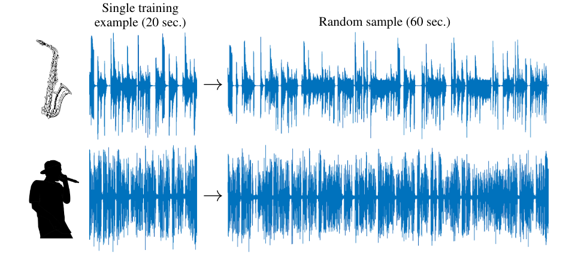
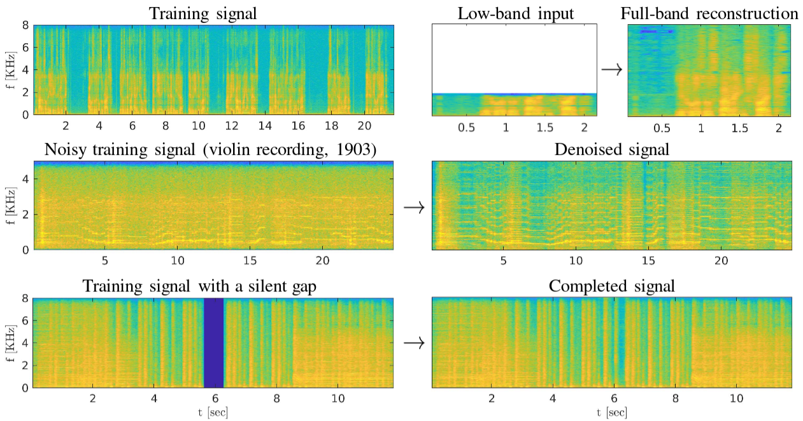

# Catch-A-Waveform

[Project Website](https://galgreshler.github.io/Catch-A-Waveform/) | [Paper](https://arxiv.org/pdf/2106.06426.pdf)

### Official pytorch implementation of the paper: "Catch-A-Waveform: Learning to Generate Audio from a Single Short Example" (NeurIPS 2021)

## Generate audio from a single audio input



## Catch-A-Waveform's Applications



## Install dependencies

```
python -m pip install -r requirements.txt
```

## Training

### Unconditional Generation

To train for unconditional inference or bandwidth extension, just place an audio signal inside the `inputs` folder
and provide it's name. The default extension is `.wav`, for a file with a different extension, provide the name with
extension:

```
python train_main.py --input_file <input_file_name>
```

For speech signals, train with `--speech` flag:

```
python train_main.py --input_file <input_file_name> --speech
```

### Inpainting

To train for inpainting task, set `run_mode` to `inpainting` and provide the indices of the hole start and end, in
samples, through the parameter `inpainting_indices`:

```
python train_main.py --input_file <input_file_name> --run_mode inpainting --inpainting_indices <hole_start_idx> <hole_end_idx>
```

### Denoising

To train denoising task, set `run_mode` to `denosing`:

```
python train_main.py --input_file <input_file_name> --run_mode denoising
```

## Inference

### Uncoditional generation

After training, a directory named after the input file will be created in the `outputs` folder. To inference from a
trained model simply run:

```
python generate_main.py --input_folder <model_folder_name>
```

This will generate a 30 [sec] length signal in the model folders, inside `GeneratedSignals`. To create multiple signals
with various length, you can use the `n_signals` and `length` flags, for example:

```
python generate_main.py --input_folder <model_folder_name> --n_signals 3 --length 60
```

To write signals of all scales, use the flag `--generate_all_scales`.

### Create music variations

To create variations of a given song, while enforcing general structure of the input (See sec. 4.2 in
our [paper](https://arxiv.org/pdf/2106.06426.pdf)), use the `--condition` flag:

```
python generate_main.py --input_folder <model_folder_name> --condition
```

### Bandwidth Exentsion

To perform bandwidth extension with a trained model run the following:

```
python extend.py --input_folder <model_folder_name> --lr_signal <low_resolution_signal_file_name>
```

`lr_signal` is a path to a low resolution audio (i.e. it's sample rate is lower than the model's). The extended output
will be created in the `GeneratedSignals` folder of the used model. In order to calculate SNR and LSD of the extended
signal, place the low-resolution and ground-truth high-resolution signals in the `inputs` folder with corresponding
filenames: `<file_name>_lr` and `<file_name>_hr`. You optionally provide the frequency response of the anti-aliasing
filter used to create the lr signal. In the `inputs` folder put a text file with two lines: the real and imaginary parts
of the frequency response. The inverse of the filter will be used to inverse the transient area of the lr signal, and
can slightly improve SNR.

### Inpainting

Inpainting is done by generating the missing part in the reconstruction signal, and then stitching it with the input:

```
python inpaint.py --input_folder <model_folder_name>
```

You can create different inpainting realization by adding the `--new` flag.

### Denoising

The denoised signal is just the reconstructed signal, so after training on a noisy signal, simply run:

```
python generate_main.py --input_folder <model_folder_name> --reconstruct
```

## Run examples

### Unconditional Generation

Music:

```
python train_main.py --input_file TenorSaxophone_MedleyDB_185
```

Speech:

```
python train_main.py --input_file trump_farewell_address_8 --speech
```

### Bandwidth Extension

First, we train a model on several concatenated sentences from VCTK Corpus:

```
python train_main.py --input_file VCTK_p347_363_to_371 --speech
```

Then we take as input a low-resolution version of new sentence by the same speaker and extend it with the trained model:

```
python extend.py --input_folder VCTK_p347_363_to_371 --lr_signal VCTK_p347_410_lr
```

To run with correcting the lr signal's transient run:

```
python extend.py --input_folder VCTK_p347_363_to_371 --lr_signal VCTK_p347_410_lr --filter_file libDs4H
```

`libDs4H` was achieved by performing `FFT(s_hr)/FFT(s_lr)` where s_lr is the lr signal created by `librosa.resample`.

### Inpainting

```
python train_main.py --input_file FMA_rock_for_inpainting --run_mode inpainting --inpainting_indices 89164 101164
```

### Denoising

```
python train_main.py --input_file JosephJoachim_BachAdagio_1904 --run_mode denoising --init_sample_rate 10000
```

Here we set the `init_sample_rate` to be 10KHz (default is 16Khz) since the old recording has limited bandwidth.

## Pretrained Models
Instead of running the examples yourself, you can download the pretrained generators and just perform inference. After downloaing the folders, put them inside `outputs` folder and run inference.

The models can be downloaded from [Google Drive](https://drive.google.com/drive/folders/1JN2QVmuKU2rCe1nAJ7jw6DsXb4F6AKpH?usp=sharing).

## Citation

If you use this code in your research, please cite our paper:

```
@article{greshler2021catch,
  title={Catch-A-Waveform: Learning to Generate Audio from a Single Short Example},
  author={Greshler, Gal and Shaham, Tamar Rott and Michaeli, Tomer},
  journal={arXiv preprint arXiv:2106.06426},
  year={2021}
}
```

### Credits

The examples signals are taken from the following websites:

- Saxophone - [Medley-solos-DB](https://zenodo.org/record/1344103#.YRt7oxJRVH4).
- Speech - [VCTK Corpus](https://datashare.ed.ac.uk/handle/10283/3443).
- Trump speech - [Miller Center](https://millercenter.org/the-presidency/presidential-speeches), presidential speech
  database.
- Rock song - [FMA](https://github.com/mdeff/fma) database.
- Joseph Joachim's recording - [Josheph Joachim](https://josephjoachim.com/2013/12/11/joachim-bach-adagio-in-g-minor-1904/) website.

Some code was adapted from:

- [SinGAN](https://github.com/tamarott/SinGAN).
- Resampling - [ResizeRight](https://github.com/assafshocher/ResizeRight).
- MSS loss function - [Jukexbox](https://github.com/openai/jukebox/).
